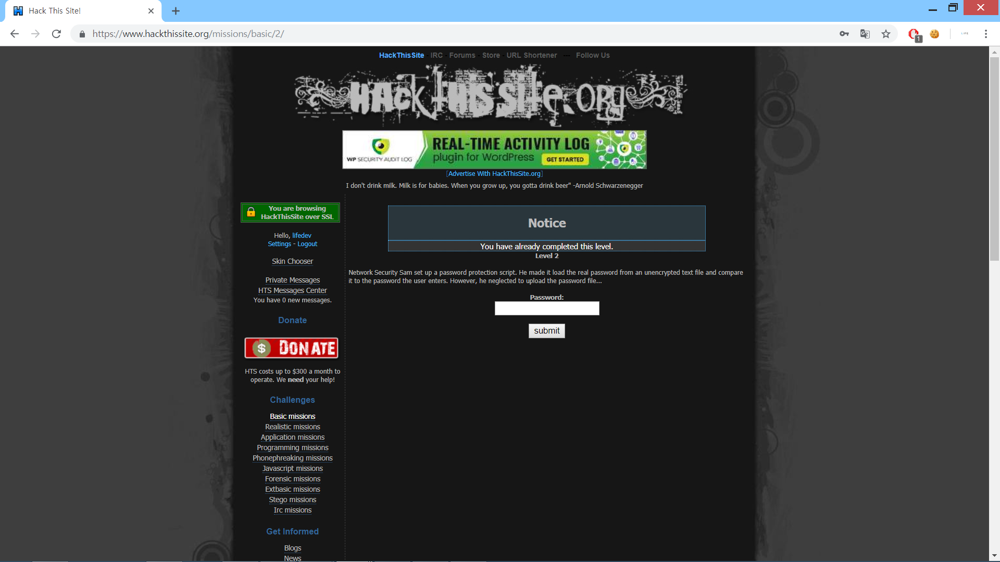
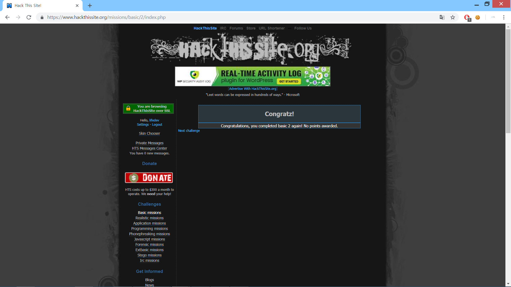

Network Security Sam set up a password protection script. 
He made it load the real password from an unencrypted text file and compare it to the password the user enters. 
However, he neglected to upload the password file...

네트워크 보안 관리자인 Sam이 사용자가 입력한 비밀번호와 암호화 되지 않은 텍스트 파일을 비교하도록 된 보안 스크립트를 설정했다고 합니다.
하지만, 그는 패스워드 파일을 올리지 않았다네요

그냥 버튼을 누르면 해결되는 모습을 볼 수 있습니다.
