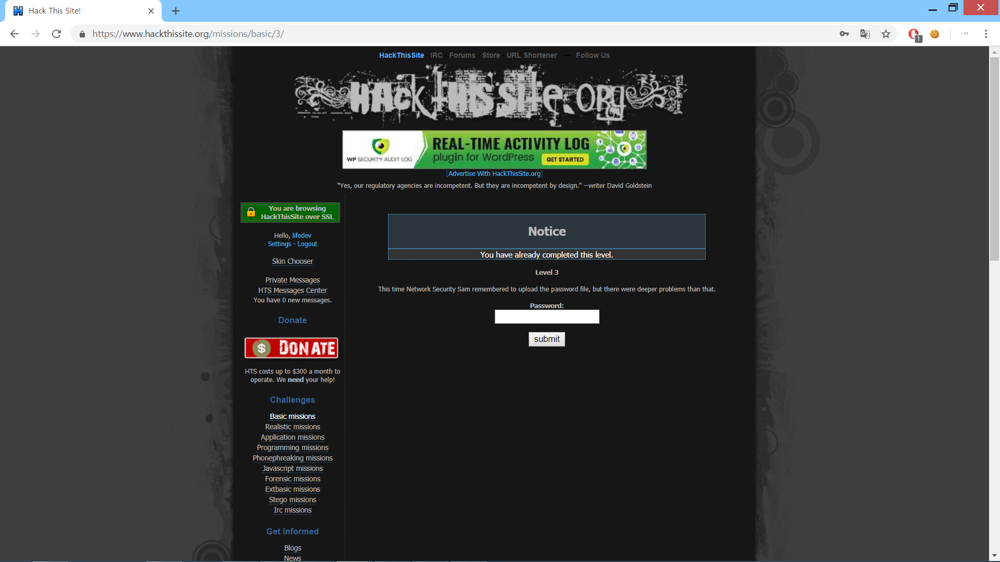
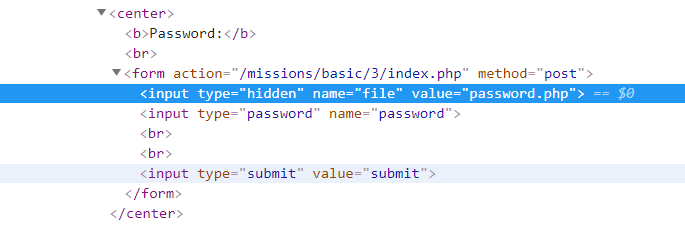
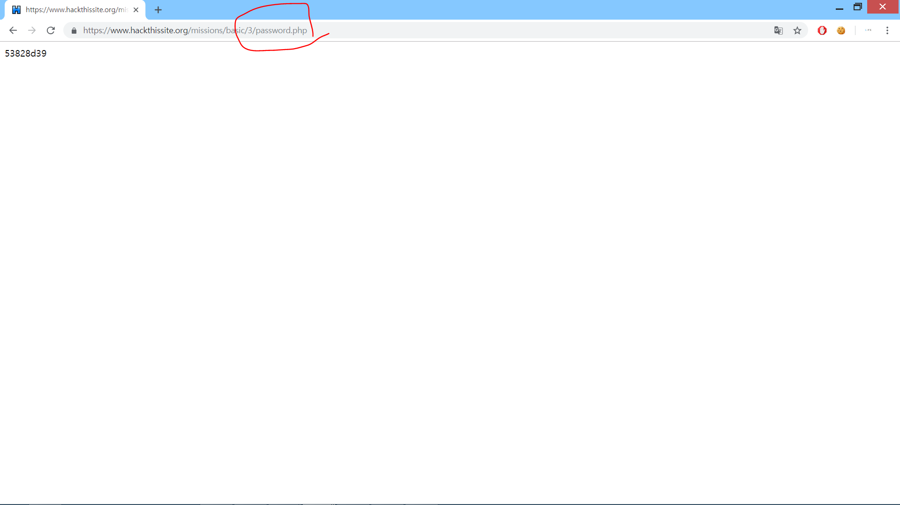
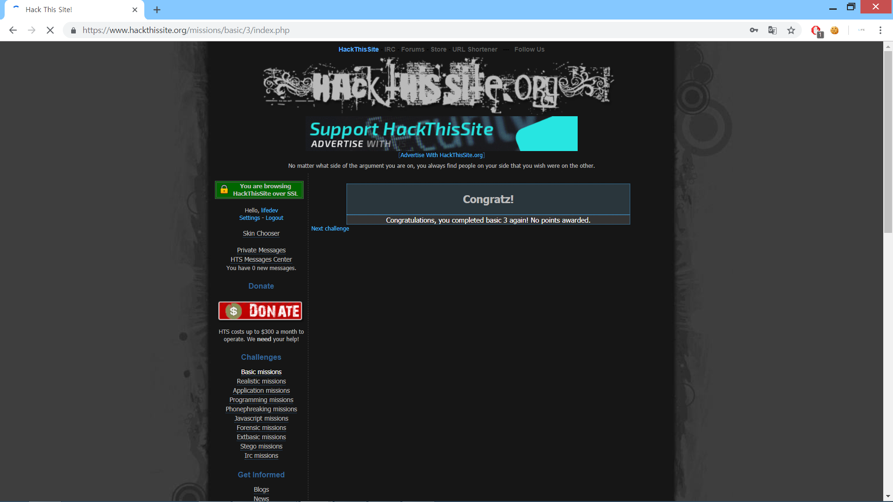

This time Network Security Sam remembered to upload the password file, but there were deeper problems than that.

Sam이 패스워드 파일을 업로드 하였지만, 더 큰 문제가 남아있다고 합니다. 

<input type="hidden" name="file" value="password.php">
이 부분을 보면 password.php가 폼을 전송할때 사용자가 입력한 값과 같이 전송됨을 볼 수 있습니다.

password.php에 들어가면 비밀번호를 알아낼 수 있습니다.

