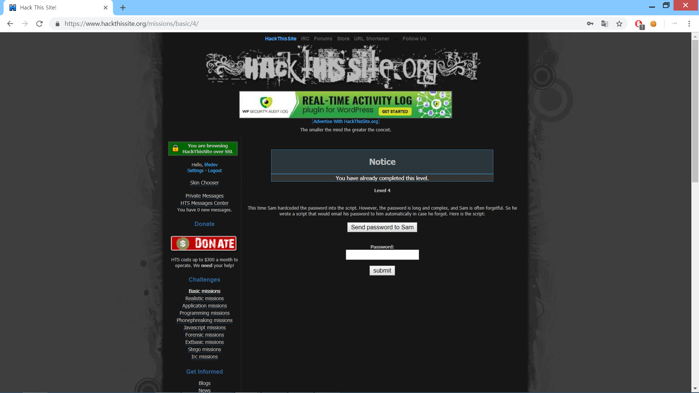
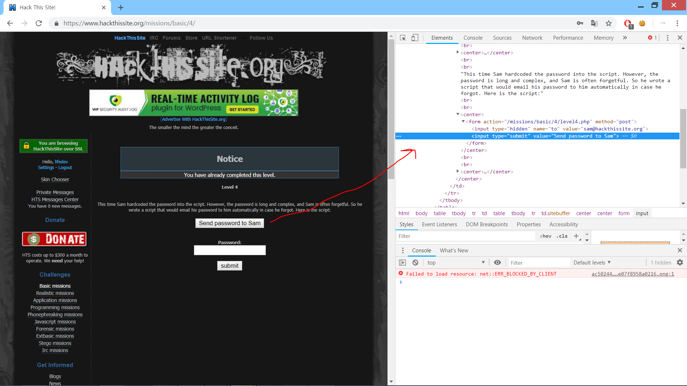
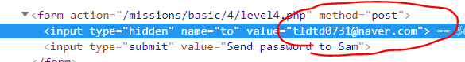
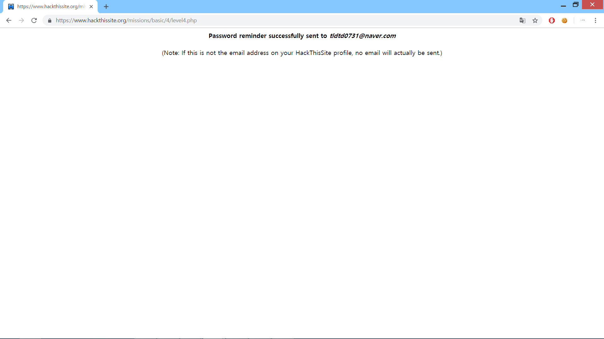

This time Sam hardcoded the password into the script.
However, the password is long and complex, and Sam is often forgetful.
So he wrote a script that would email his password to  automatically in case he forgot.
Here is the script:

Sam이 비밀번호를 잊어버렸을 경우를 대비해 저 버튼을 누르면 자신에게 이메일로 비밀번호를 알려주는
스크립트를 짰다고 합니다.

저 버튼에 해당하는 태그입니다.
그 위에 hidden태그에 이메일 주소가 있습니다.

자신의 이메일 주소로 이를 바꿔주면 해당 메일로 비밀번호가 도착합니다.

